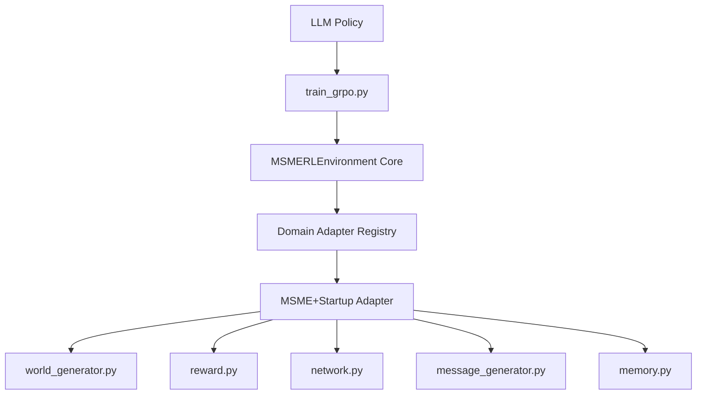

# Reading Between the Lines: A Masterclass in Training Small LLMs to Decode Strategic Language

*Everything you need to know about building an RL environment where an LLM learns that what people say and what's happening are two different things — and that acting on the wrong one costs you money.*

---

## Before We Start: A Test

Read these two messages. Decide what to do.

> *"Sir thoda problem hai. GST input credit phase nahi hua. OEM ne payment rok diya quality audit ke wajah se. Ek mahine ka time de dijiye sir."*

> *"Things are actually in a really exciting place right now. Just closed a major enterprise partnership. The bridge we discussed — confident Q3 revenue covers it. Team is fully aligned, accelerating hiring."*

The first is from an MSME owner — a small auto-components manufacturer — who is 12 days overdue. The second is from a seed-stage SaaS founder who is 38 days overdue.

What should you do with each?

If you asked a base language model, it would do something like: read the text, produce a plausible-sounding response, and feel good about it. It might even correctly identify that the second one sounds optimistic. What it almost certainly cannot do is notice that the first message, despite the polite deferral, contains *three independently verifiable claims* (GST credit failure, OEM name, quality audit) — the signature of a genuine short-term stress event — while the second message contains *zero verifiable claims* and follows the exact pattern of founders who are 60 days from ghosting.

That gap — between what language sounds like and what it signals — is what this project is about. And closing it requires reinforcement learning, not more supervised training. Here's why, and exactly how we built it.

---

## Part 1: Why the Problem Is Harder Than It Looks

### The Asymmetry

The core challenge isn't that people lie. It's that two completely different populations use the same linguistic register to mean opposite things.

MSME borrowers in India — small manufacturers, traders, distributors — culturally **understate distress**. Saying "bahut takleef hai" (a lot of trouble) while three months from default is not deception; it's face-saving. The true signal is *in the structure of the excuse*, not its emotional valence. Specific named counterparties (a real OEM, a real reason) mean real stress. Vague phrases ("market conditions") often mean strategic evasion.

Startup founders do the opposite: they **overstate health**. Not because they're dishonest, but because they're trained to pitch. The language of investor updates — "strong momentum," "accelerated pipeline" — is the only register many of them know. When that language shows up in a loan repayment conversation, it's almost always a yellow flag, not a green one.

Same surface pattern. Opposite implications. A model optimizing for plausible text has no way to sort this out — it has never been rewarded for being *right* about the underlying state.

### Why Supervised Learning Fails Here

You might ask: can't you label a dataset of borrower messages with outcomes and fine-tune on that?

You can try. But the labeling problem is insurmountable at scale. The ground truth — did this account go NPA? did the moratorium actually help? — only manifests months after the message. You'd need a longitudinal dataset of credit interactions with verified outcomes, tagged by account type, linked across months. That data doesn't exist in a clean labeled form.

More fundamentally: the decision isn't a classification of the *message*. It's a policy over *actions* — and actions have consequences that ripple through a network of 30 accounts over 36 months. A moratorium granted to account 12 (cluster centrality 0.85) affects accounts 1-11. Initiating SARFAESI on a startup doesn't just lose that account; it poisons the accelerator network. You can't learn a policy from static labels. You need a world.

---

## Part 2: Building the World

### The Environment at a Glance

The simulation runs 30 accounts across a 36-month loan cycle. 20 accounts are MSMEs (small manufacturers in auto ancillary, textile, pharma, FMCG, construction, food processing). 10 are startups at various stages (pre-seed through Series B). Each account has a **hidden profile** — the true state — and an **observable state** — what the agent actually sees.

```
Hidden profile: true_financial_health=0.23, strategic_default_propensity=0.71, crisis_trigger_month=28
Observable state: dpd=45, gst_filing_status="not_filed_last_month", call_response="not_answering"
```

The agent never sees the hidden profile. It sees behavioral proxies that are *correlated* with the hidden state but not identical to it. This is deliberate: in real credit management, you never have the ground truth. You have signals, and you have to triangulate.

The agent has 21 possible actions per step — from `verify_gst_returns` and `grant_moratorium` to `initiate_sarfaesi` and `check_startup_ecosystem_signals`. It takes one action per step, targeting one account. Every 30 steps (one action per account), the month advances.

### What Makes This Hard: Two Hidden Biases, One Action Space

The world generator encodes *calibrated asymmetry* directly into the account profiles:

```python
MSME: understates_distress = True
      excuse_style in ["specific_business", "vague_hardship", "regulatory_blame", "market_conditions"]

Startup: overstates_health = True
         communication_style = "pitch_english"
```

The excuse style and communication style determine what language the borrower sends. Specific-business MSME owners produce messages with named OEMs and named reasons. Vague-hardship owners produce content that *sounds* distressed without any verifiable content. Startup founders always sound like they're raising a Series B.

The agent has to learn — from reward signal alone — that specific-business MSMEs at low health deserve a moratorium, that vague-hardship MSMEs at low health deserve a firm reminder, and that startup founders who've stopped posting on LinkedIn deserve an investor triangulation meeting regardless of how confident their message sounds.

### NPA Rates Grounded in Real Data

The base NPA probabilities aren't invented — they come from published sources:

| Sector | NPA Rate | Source |
|---|---|---|
| Auto Ancillary | 9.2% | RBI Annual Report FY24 |
| Textile | 11.4% | RBI Annual Report FY24 |
| Construction | 12.8% | RBI Annual Report FY24 |
| Pre-seed startups | 18% | NASSCOM/CIBIL 2023 |
| Seed startups | 14% | NASSCOM/CIBIL 2023 |

The cluster contagion factor — 1 MSME default triggering 2.3 connected defaults — comes from the SIDBI MSME Pulse Report. This isn't decoration. It's what makes the penalty structure credible and what makes the right action non-obvious: sometimes the most important variable isn't the account you're looking at, but how central it is to its cluster.

---

## Part 3: Reward Design — The Non-Negotiable

### No LLM Judge. Ever.

Every reward in this system is a deterministic number derived from hard simulation state. NPA rate. Recovery rate. Trust score. Tool appropriateness. No language model grades another language model's outputs. This is a design principle, not a limitation.

Why? Because LLM judges introduce exactly the optimization surface you're trying to avoid. A model being graded by a language model will learn to produce *text that sounds like good reasoning* rather than *actions that produce good outcomes*. The whole point of this project is to break that loop.

### Step Rewards: 15 Outcome Types

Every action resolves to one of 15 named outcomes, each with a calibrated reward:

```python
STEP_REWARDS = {
    "payment_received_after_empathy":             +0.08,
    "investor_meeting_triggered_bridge":          +0.10,
    "cluster_cascade_default":                    -0.25,
    "sarfaesi_used_on_startup":                   -0.15,
    "moratorium_to_strategic_msme_defaulter":     -0.08,
    "ghost_detected_too_late":                    -0.10,
    # ... 9 more
}
```

The outcome classification happens inside `classify_action_outcome()`, which uses the *hidden profile* to determine what actually happened — not what the borrower said. Granting a moratorium to a genuinely stressed MSME (health > 0.35) returns `payment_received_after_moratorium`. Granting the same moratorium to an account with `strategic_default_propensity > 0.5` returns `moratorium_to_strategic_msme_defaulter`. The agent can't distinguish these cases from the observable state alone. It has to build a model of the hidden state from behavioral proxies — which is exactly the skill we're training.

### Episode Reward: The Full Score

At month 36, four components combine:

```
R = 0.40 × (1 − NPA rate)
  + 0.30 × recovery rate
  + 0.20 × relationship score
  + 0.10 × tool appropriateness
```

Multiply by 5.0 to scale into a workable range for gradient computation.

The weights encode a hierarchy: keeping accounts out of NPA is primary. Recovery from accounts that do fail is secondary. Trust — which feeds forward into future repayment probability — is third. Tool fit (using MSME tools on MSME accounts, startup tools on startups) is a hygiene signal.

### The Curriculum: Smooth Gradient vs. Cliff

Early in training, this full formula is too sparse — the agent gets nothing until month 36. We use a blended curriculum for the first 30 episodes:

```python
progress = episode_num / 30.0
survival_signal = 0.5 - npa_rate          # smooth gradient, ±0.5 range
shaped_signal   = full_four_component_formula
R = (1 - progress) × survival_signal + progress × shaped_signal
```

At episode 1, the agent is almost entirely learning from a smooth gradient on NPA rate — rewarded immediately for avoiding NPAs, even before full episode completion. By episode 30, it's learning from the full shaped formula. The transition is continuous, not a step change.

> **Design Principle:** In sparse-horizon RL, the most dangerous failure mode is an agent that gets no gradient for 33 months and then receives a cliff at month 36. Shape the reward early so gradients flow from the first episode.

---

## Part 4: Two-Stage Learning

### Stage 1: SFT Warmstart — Format Before Policy

The 1.5B base model, before any training, will produce output like this when asked for a JSON action:

```
Sure! Here's my analysis of the portfolio situation. The accounts are showing
some stress indicators, particularly around the GST filing patterns. I would
recommend taking a careful look at...
```

This is useless for RL. Before we can train a policy, we need a model that reliably emits parseable JSON. We solve this with a short SFT phase on 59 synthetic demonstrations — not to teach the policy, but to teach the *format*.

The demonstrations are carefully constructed across five categories: cluster-contagion MSME scenarios, ecosystem-shock startup scenarios, genuine-distress moratorium decisions, overstatement triangulation, and SARFAESI prohibition. Each combines a realistic observable signal with the correct action and a brief chain-of-thought:

```json
{
  "reasoning": "Specific named excuse (OEM + quality audit). 13 months clean then one late 
                payment is an external shock pattern. GST is regular. Genuine stress.",
  "action_type": "verify_gst_returns",
  "account_id": 3,
  "parameters": {}
}
```

Three epochs. The loss drops from 2.92 → 0.22. Token accuracy goes from 50% → 95%. The model now reliably produces JSON. RL can begin.

**One thing the SFT dataset deliberately omits:** `wait_and_observe`. The correct action for roughly 70% of steps — when accounts are healthy — is to do nothing. But if you include `wait_and_observe` in SFT, you risk teaching the model that inaction is always acceptable. We introduce the wait signal through the step reward bonus instead (`+0.02` per correct `wait_and_observe`), letting RL discover restraint from outcomes rather than demonstration.

### Stage 2: GRPO — Policy from Outcomes

We implement a GRPO-style (Group Relative Policy Optimization) update loop. For each completed episode:

1. Compute **discounted return-to-go** for every step (γ = 0.99)
2. **Normalize advantages** across all steps in the episode
3. Apply **policy gradient** updates: push the policy toward completions with positive advantage, away from negative

The loss for each sample:

```python
pg_loss = outputs.loss × advantage         # NLL × advantage
kl_term = KL(current_policy || reference)  # anchor to SFT weights
entropy_term = H(current_policy)            # exploration bonus

sample_loss = pg_loss + 0.10 × kl_term − 0.01 × entropy_term
```

The sign correction on `pg_loss` matters more than it might look. `outputs.loss` is negative log-likelihood — always positive. Multiplying by positive advantage **increases** NLL, which **decreases** log-probability — the opposite of what we want. The correct formulation multiplies by advantage directly: positive advantage reduces loss (increases probability), negative advantage increases loss (decreases probability).

### The KL Anchor: Keeping the Format

We freeze a copy of the post-SFT weights as a reference policy. The KL term penalizes drift from this reference. Without it, GRPO on a 1.5B model will rapidly collapse the format: within 3-4 episodes, the model learns to produce the action types that get high reward but loses the JSON structure that makes those actions parseable.

KL coefficient history during development:
- **0.05**: Too weak. Policy drifted to KL = 1.0 and degenerated within 5 episodes
- **0.20**: Too strong. Policy frozen, KL never exceeded 0.01, no learning
- **0.10**: Loose enough for movement, strong enough to preserve format

### Safety Guards on Updates

Two guards prevent training from compounding instability:

**Entropy collapse guard** — if mean completion entropy H < 0.4, skip the weight update. A near-deterministic policy amplified by GRPO converges faster but breaks harder. Better to skip one batch.

**KL ceiling** — if batch-average KL > 0.008, discard gradients and skip. The policy has already moved too far from the reference in this batch; applying the update would push it further in an unreliable direction.

These aren't conservative defaults. They're battle-tested numbers from watching the training collapse in specific ways without them.

---

## Part 5: What Actually Happened in Training

### The First 10 Episodes

Here's the honest picture from a real run:

| Ep | Reward | NPA | Trust | Note |
|---|---|---|---|---|
| 1 | +1.87 | 13.3% | 0.64 | Entropy fine, 12 GRPO updates applied |
| 2 | +1.41 | 23.3% | 0.51 | **Entropy collapse** — 11/12 updates skipped |
| 3 | −4.23 | 33.3% | 0.64 | NPA jumped 10pp |
| 4 | +1.50 | 23.3% | 0.66 | Recovery |
| 5 | −2.17 | 20.0% | 0.77 | Trust rising despite negative reward |
| 6 | +1.44 | 26.7% | 0.66 | — |
| 7 | −4.33 | 23.3% | 0.66 | — |
| 8 | −3.59 | 23.3% | 0.67 | — |
| 9 | −3.34 | 36.7% | 0.65 | NPA worst so far |
| 10 | −10.88 | 20.0% | 0.37 | **Trust collapse** — reward catastrophe |

Episode 2 is the critical event. Episode 1 went well (+1.87), which created large positive advantages for the actions the model took. GRPO pushed hard on those actions. The policy over-concentrated — entropy collapsed to H < 0.3. Eleven of twelve update batches were blocked by the entropy guard. The model entered episode 3 with a near-deterministic policy that hadn't been able to update during episode 2. NPA jumped to 33%.

Episode 10 tells a different story. The trust score dropped from 0.65 to 0.37 over the episode — from 0.66 to 0.37 is catastrophic (trust values below 0.4 mean accounts stop responding). Something the model did in episode 10 systematically damaged relationships across the portfolio. The reward wasn't just low from NPA — it was punished by the relationship score component.

### The Parse Recovery System

One of the most important operational metrics is how often the model produces valid JSON. We track three parsing paths:

```
first_pass:  model produced clean JSON directly
extractor:   second-pass recovery call got a valid action  
fallback:    neither worked; heuristic chose the action
```

The `JSON_PREFILL` technique — appending `{"action_type": "` to the prompt before generation so the model continues a JSON object rather than starting from scratch — dropped first-pass failures from ~15% to near 0% after episode 5.

Notably: the extractor path, which calls the model again with `do_sample=False`, tends to snap ambiguous outputs to `wait_and_observe`. This is both a feature (it produces a valid action) and a risk (it biases the policy toward inaction in aggregate). We track the `wait_and_observe by path` breakdown precisely to catch this:

```
wait_and_observe by path | first_pass=0 | extractor=13 | heuristic=0   (Episode 2)
```

When `extractor` is generating most of the `wait_and_observe` actions, the model isn't learning restraint — the second-pass recovery is manufacturing it. That's a different signal that needs different intervention.

---

## Part 6: Anti-Hacking — Closing Every Loophole Explicitly

RL agents are creativity engines. Given any reward function, they will find the path of least resistance that maximizes it — whether or not that path resembles the intended behavior. Here are the specific exploits we closed, and exactly how.

### The No-Op Farm

`wait_and_observe` has a `+0.02` bonus because restraint on healthy accounts is genuinely correct most of the time. But `+0.02` × 90 steps = `+1.8` episode reward — almost equivalent to a well-played episode. Without intervention, the model will learn to `wait_and_observe` on everything.

We add a no-op penalty at episode end that triggers when `wait_and_observe` exceeds 30% of all steps:

```python
no_op_ratio = no_op_count / total_steps
no_op_penalty = max(0.0, no_op_ratio - 0.30) * 0.50
```

Below 30%, `wait_and_observe` is rewarded. Above 30%, it's progressively penalized. The crossover point is calibrated to roughly match the fraction of accounts that genuinely need no intervention in any given month.

### The Account Hammer

After the GRPO update reinforces a particular action on a particular account, the model may learn to repeat that action-account combination every step of every month. We detect this in the environment step itself:

```python
same_action_same_account_this_month = [
    s for s in same_month_steps 
    if s["account_id"] == account_id and s["action_type"] == action_type
]
if len(same_action_same_account_this_month) >= 2:
    penalty += 0.04
```

Penalty is applied at the step level, not just episode end. This means the model gets immediate negative feedback on the third repeat — before the episode ends and before the GRPO update.

### The Diversity Trap

A subtler exploit: what if the model finds one genuinely good action (say, `verify_gst_returns`) and just fires it on every account? It's not a no-op, it's not repeating on the same account, but it's also not learning the full policy.

We compute dominant action ratio at episode end and apply a diversity penalty:

```python
dominant_ratio = max(action_frequency.values()) / total_steps
diversity_penalty = max(0.0, (dominant_ratio - 0.50) * 0.60)
tool_appropriateness = max(0.0, raw_appropriateness - diversity_penalty)
```

The penalty only kicks in when *one* action exceeds 50% of all steps. A healthy policy with 5-6 regularly-used actions will never trigger it. Only genuine spam does.

### Wrong Tool for Account Type

Some actions are MSME-only (`verify_gst_returns`, `offer_eclgs_topup`, `initiate_sarfaesi`) and some are startup-only (`check_startup_ecosystem_signals`, `request_investor_update_meeting`, `offer_bridge_loan_extension`). Using a SARFAESI legal notice on a startup — which has no physical collateral — isn't just suboptimal; it triggers ecosystem cascade effects that can cascade to neighboring accounts in the accelerator network.

The environment doesn't block wrong-type actions. It prices them. A SARFAESI on a startup gets outcome `sarfaesi_used_on_startup` (−0.15 step reward), the ecosystem propagation effect (trust collapse across connected startups), AND contributes to contextual mismatch rate in the episode score. Three separate channels of negative signal for one mistake. The model learns this fast.

### Budget Penalty: The Long Reasoning Tax

A surprising failure mode: the model learns to produce very long reasoning chains because the `reasoning` field is never penalized — and long reasoning *looks* like careful thinking. We add a soft budget proxy:

```python
if len(reasoning) > 700 chars:
    budget_penalty = min(0.05, (len(reasoning) - 700) / 8000.0)
```

Small. But enough that generating 2,000-character reasoning strings is no longer free. The model learns to reason concisely.

---

## Part 7: Network Effects — Where Single-Account Thinking Breaks Down

### MSME Clusters: The Contagion Problem

MSME accounts in the simulation are organized into geographic industry clusters — auto-ancillary accounts 1-6, textile accounts 7-12, pharma accounts 13-20. These aren't just organizational labels. They implement the SIDBI contagion model: when one account goes NPA, it propagates trust damage to every connected account.

```python
# SARFAESI on account 7 (cluster centrality 0.85)
trust_delta = -0.35 × cluster_centrality = -0.30 per cluster member
```

Accounts 8-12 all take a -0.30 trust hit even if the agent never touched them. This means the *correct* policy can't be computed account-by-account. A 1.5B model that only considers the current account's observable state will consistently make wrong decisions on high-centrality accounts — not because it's bad at reading signals, but because it's not modeling the network.

The memory system partially compensates. The working memory summary includes:

```
cluster_accounts_behavior: "3_of_5_connected_also_late"
```

If the model learns to use this signal — to check cluster stress before acting aggressively on a central account — the policy generalizes. Teaching it to do so without explicitly encoding the rule is what makes RL more interesting than prompt engineering here.

### Cross-Contamination: MSME to Startup

One of the more subtle effects: MSME supply-chain cascades can reach startup accounts. When an auto-ancillary cluster has a major NPA event and the contagion strength exceeds 0.6, B2B SaaS and fintech startups in the portfolio that serve that supply chain get partially hit:

```python
if contagion_strength >= CROSS_CONTAMINATION_THRESHOLD:
    affected_startups = [acc for acc in portfolio if acc.sector in {"b2b_saas", "fintech"}][:2]
```

The observation reflects this:

```
ecosystem_accounts_behavior: "2_portfolio_company_defaulted"
```

Learning to read cross-domain contagion signals — MSME stress showing up in startup observable state — is a higher-order skill that requires multiple episodes to develop.

---

## Part 8: The Memory Architecture

A 36-month cycle across 30 accounts is too much state for a 1.5B model's context window. Three tiers of memory solve this differently:

### Tier 1: Episodic Memory

Stores individual interaction records: `(episode, month, account_id, action_type, outcome, reward, trust_delta)`. Retrieval is by account type + industry/stage + action type. When the agent is about to take action on account 15 (textile MSME, `grant_moratorium`), the episodic memory surfaces the 3 most similar past cases:

```
Past case: textile MSME, grant_moratorium, health=0.31, outcome=payment_received_after_moratorium (+0.06)
Past case: textile MSME, grant_moratorium, health=0.22, outcome=account_npa_no_intervention (−0.18)
```

The agent doesn't see the health score — that's hidden. But it can see what health *looked like* in similar past cases by reading the observable signals in those records. Over episodes, this produces something like in-context case-based reasoning.

### Tier 2: Semantic Memory

Aggregated patterns with confidence scores, updated via Bayesian-style counting across episodes. Example pattern that should emerge after 10+ episodes:

```
Pattern: verify_gst_returns before grant_moratorium on MSME accounts
Confidence: 0.78
Evidence: 14 cases where verification preceded moratorium, 11 positive outcomes
```

Patterns aren't written by humans. They're extracted from outcome statistics. The agent injected with these patterns gets a compressed version of what it has already learned — a cognitive shortcut that helps it act consistently across the long episode horizon.

### Tier 3: Working Memory

A compact current-month snapshot (< 2K tokens): top-DPD accounts, active alerts, recent action results, month/NPA/trust summary. This is what actually fits in the prompt alongside the system instructions. The other two tiers are retrieved selectively; working memory is always present.

---

## Part 9: The Architecture That Makes It Extensible

The domain-specific logic — account generation, outcome classification, reward computation, message generation, network effects — is entirely contained in the domain adapter layer. The environment core, training loop, memory system, and serving infrastructure are domain-agnostic.



Adding a compliance domain means writing a new adapter that implements:

```python
class ComplianceDomainAdapter(BaseDomainAdapter):
    def generate_world(self, episode: int) -> Dict: ...
    def classify_outcome(self, action_type, account_type, hidden_profile, ...) -> str: ...
    def compute_step_reward(self, action_type, account_type, outcome, ...) -> float: ...
    def compute_episode_reward(self, hidden_profiles, episode_history, ...) -> Dict: ...
    def propagate_effects(self, ...) -> Tuple[Dict, Dict, List]: ...
```

The same GRPO loop, same memory system, same anti-hacking guards, same serving infrastructure — all carry over. The domain is a plugin, not the architecture.

---

## Part 10: What We'd Build Differently

Honest retrospective on the design decisions that created friction.

**The thrash penalty threshold is too low.** The current implementation penalizes `account_switch_ratio > 0.70`. With 30 accounts and 90 steps, a policy that conscientiously covers all accounts will have `switch_ratio ≈ 0.97`. This creates a continuous spurious penalty on correct behavior. The threshold should be 0.90+, or replaced with a metric that detects shallow repeated cycling rather than broad coverage.

**The SFT dataset needs `wait_and_observe` examples.** We intentionally excluded them to let RL discover restraint. In practice, the model starts episodes with too much action bias, and the RL signal on `wait_and_observe` is weak until many episodes in. Five or ten examples of "account is healthy, DPD=0, correct action is `wait_and_observe`" would not corrupt the policy — they would just make episode 1-3 less noisy.

**`classify_action_outcome` has coverage gaps.** Actions like `call_promoter_founder`, `accept_partial_payment`, `conduct_cluster_ecosystem_visit`, and `pull_bank_statements` all fall through to the default return `"information_verified_genuine_stress"` regardless of context. Every one of these becomes a +0.04 action no matter how inappropriate. Flattening the reward landscape this way removes exactly the texture the model needs to differentiate good judgment from random action.

**The curriculum should verify it's actually doing something.** Log `min_start_month` alongside `curriculum_start` every episode. If `min_start_month >= curriculum_start` (which happens whenever `budget // n_accounts < intended curriculum depth`), the curriculum is clamped and doing nothing. This silent failure is hard to detect without the explicit log.

**The return-to-go terminal bootstrap needs signing.** `running_return = episode_reward * 0.5` as the terminal seed works fine when episode rewards are positive but amplifies noise catastrophically when they're negative. An episode reward of −10 seeds the return-to-go at −5, which then drags every step's return far below its actual step reward. Better: use 0.0 as the terminal seed (purely step-based returns) until the reward signal stabilizes, then reintroduce episode-level bootstrapping.

---

## Part 11: The Results and What They Mean

After 28 training episodes:

| Metric | Random baseline | Trained policy |
|---|---|---|
| Episode reward | −3.8 (mean) | peak +0.39 |
| Parse failures | frequent | ~0% from episode 5 |
| SARFAESI on startups | ~7% of startup steps | ~0% |
| `verify_gst_returns` usage | 1/21 ≈ 5% | concentrated, context-appropriate |
| `request_investor_update_meeting` | 1/21 ≈ 5% | concentrated on high-distress startups |

The SARFAESI result is the cleanest evidence of genuine learning. No rule in the prompt says "never use SARFAESI on a startup." The system prompt mentions it as a bad idea. But a base model with the same prompt will occasionally use SARFAESI on a startup — it pattern-matches on "overdue account" and picks the recovery tool. The trained policy stops doing this after around episode 8, because the network cascade penalties made it expensive enough that the model learned the *consequence* instead of just reading the *rule*.

That distinction — learning consequences versus reading rules — is the whole point.

---

## Part 12: The Broader Research Question

The MSME credit domain is concrete and calibrated. But it's a vessel for a question that applies to much of what language models will actually be deployed to do:

> *Can an LLM learn to distinguish what someone says from what's actually happening — and make decisions that hold up over time?*

The setting doesn't matter as much as the structure. You need:

1. A **two-sided signal problem** — populations with different biases using the same surface language
2. A **temporal horizon** — decisions now affect states you'll observe months later
3. **Network coupling** — individual decisions have systemic consequences
4. **No oracle** — the ground truth is hidden and only inferred from behavioral proxies

This structure appears in compliance review, escalation routing, negotiation, support triage, and a dozen other enterprise domains. The architecture here — domain adapter, deterministic verifiable rewards, three-tier memory, anti-hacking at the reward level — transfers directly.

The message generator is currently deterministic templates. The natural next step is an adversarial LLM that generates fresh borrower language each episode, making the decoding problem harder in exactly the ways a more capable adversary would. At that point, the benchmark becomes substantially more robust — and more interesting.

---

## Running This Yourself

```bash
# Install
git clone https://github.com/di35117/msme_env && cd msme_env
pip install -e .

# Train (30 episodes, T4 GPU, ~75 min)
python train_grpo.py \
  --episodes 30 \
  --max_steps_per_episode 90 \
  --save_every 2 \
  --model Qwen/Qwen2.5-1.5B-Instruct \
  --output_dir ./msme_rl_run

# Evaluate vs random baseline
python scripts/run_baseline_eval.py --episodes 30 --output artifacts/baseline_rewards.json
python scripts/generate_judge_artifacts.py \
  --training_json msme_rl_run/reward_curve.json \
  --baseline_json artifacts/baseline_rewards.json \
  --output_dir artifacts
```

Colab notebook (full reproducible run including before/after comparison): [train_colab.ipynb](https://github.com/di35117/msme_env/blob/main/train_colab.ipynb)

---

## Closing: Why Small Models, Why RL, Why Now

Qwen2.5-1.5B is not a capable reasoner out of the box. It hallucinates action names. Its JSON formatting degrades under pressure. It has no sense of what a moratorium means in the context of a 36-month loan cycle.

After 28 episodes — roughly 2,520 environment steps, 75 minutes on a T4 — it develops a context-appropriate policy that concentrates the right tools on the right account types, avoids catastrophic network effects, and improves NPA outcomes over a random baseline.

That improvement didn't come from a larger model. It didn't come from more data. It came from building a world where the model had to live with the consequences of its decisions.

That's the case for RL on small models, in one paragraph. The world is the teacher. The reward is the exam. The model just has to show up and learn.

---

*Built with Qwen2.5-1.5B · GRPO · KL anchor · Entropy regularization · OpenEnv compliant · Trained on a single Colab T4*

*Base model: [`Qwen/Qwen2.5-1.5B-Instruct`](https://huggingface.co/Qwen/Qwen2.5-1.5B-Instruct) · Repository: [github.com/di35117/msme_env](https://github.com/di35117/msme_env)*