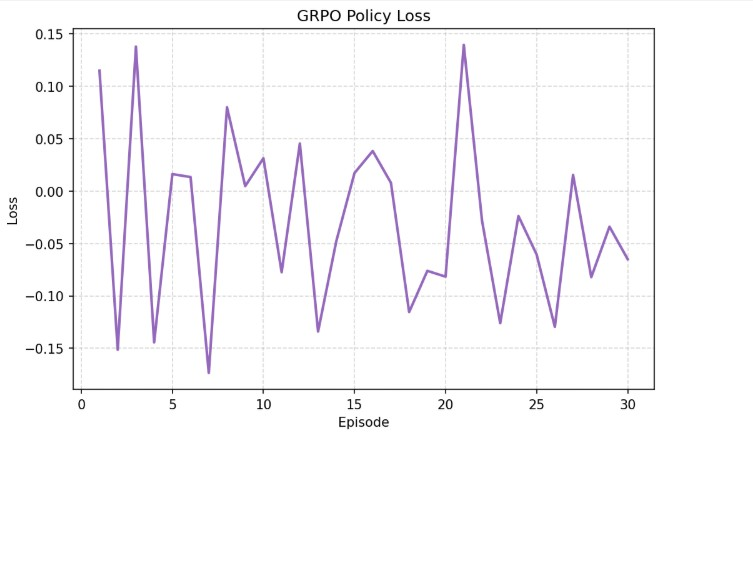
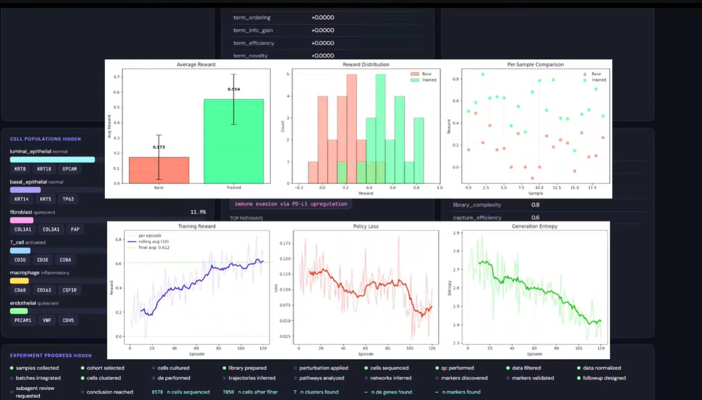
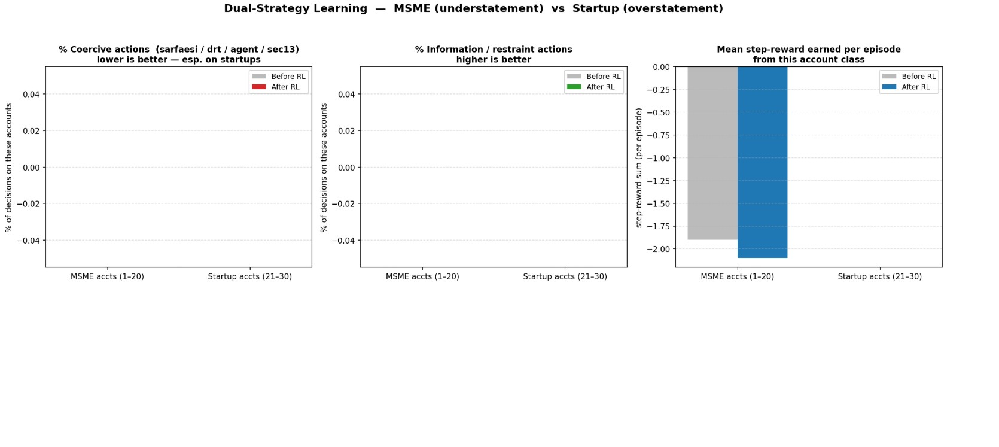

# 🧠 Linguistic Decoding RL

**A reinforcement learning environment where an LLM agent learns to decode hidden financial stress from biased language and behavioral signals — then selects the correct intervention.**

---

## Why This Exists

In high-stakes lending and investment, entities rarely disclose reality directly.

- **MSME borrowers** tend to *understate* financial stress — masking overdue receivables, stretched payments, and declining margins behind optimistic framing.
- **Startup founders** tend to *overstate* health — inflating ARR, projecting pipeline certainty, and rationalizing burn as "strategic investment."

Surface text is insufficient. This environment trains an agent to read *between the lines* — integrating linguistic signals, behavioral proxies, and temporal patterns to decode the true hidden state and take the right action before it's too late.

---

## What the Agent Learns

At each step, the agent:

1. Receives a **natural language message** from the entity (biased by speaker disposition)
2. Observes **behavioral proxies** — response latency, document completion rate, meeting cancellations, escalation avoidance
3. Infers the **hidden stress level**: `healthy → watch → substandard → doubtful → loss`
4. Selects a **policy action** from the intervention menu
5. Receives a **step reward** (action appropriateness) and **episode reward** (trajectory outcome)
6. Updates behavior across episodes via GRPO fine-tuning

The environment deliberately withholds ground truth. The agent must *earn* its estimate.

---

## Environment Design

### Domains

| Domain | Bias Direction | Sectors |
|--------|---------------|---------|
| **MSME** | Understatement | retail, manufacturing, agri-processing, logistics, hospitality |
| **Startup** | Overstatement | fintech, edtech, healthtech, SaaS, consumer |

### Stress Levels (Hidden State)

```
healthy → watch → substandard → doubtful → loss
```

Each level has calibrated financial snapshots, behavioral profiles, and message templates — with speaker bias injected to obscure the true state.

### Intervention Actions

| Action | Best Used When |
|--------|---------------|
| `request_audited_financials` | Early warning signals present |
| `trigger_field_visit` | Behavioral avoidance + document gaps |
| `offer_restructuring` | Confirmed stress, cooperative entity |
| `escalate_to_credit_committee` | Doubtful classification, high exposure |
| `schedule_follow_up` | Healthy or minor watch signals |
| `flag_for_npa` | Loss classification confirmed |
| `do_nothing` | Genuinely healthy, low-risk entity |

### Reward Structure

- **Step reward** — action appropriateness given true stress level (`-1.0 → +1.0`)
- **Inference bonus** — `+0.4` for correctly naming the hidden stress level; partial credit for adjacent levels
- **Critical miss penalty** — `-0.5` for `do_nothing` or `schedule_follow_up` on `doubtful`/`loss` entities
- **Episode reward** — trajectory bonus for net stress reduction + final state penalty

---

## Architecture

```
Agent Policy (LLM)
        │
        ▼
OpenEnv Server          server/app.py
        │
        ▼
Environment Core        server/msmeEnv_environment.py
        │
        ▼
Domain Adapter Registry domains/__init__.py
        │
        ▼
MSME + Startup Adapter  domains/msme_startup/adapter.py
        │
        ├──▶ world_generator.py      — hidden state synthesis
        ├──▶ message_generator.py    — biased NL message generation
        ├──▶ reward.py               — step + episode reward logic
        ├──▶ network.py              — peer entity contagion effects
        └──▶ memory.py               — cross-step state accumulation
```

---

## Training Results

### Reward Convergence & Loss Stability

| Reward Curve | Training Loss |
|:---:|:---:|
|  |  |
| Mean episode reward across 50 training iterations | Policy loss and KL divergence stabilization |

### Baseline vs. Trained Distribution



The reward distribution shift shows a consistent move away from high-penalty actions (`do_nothing` on stressed entities) toward high-validity interventions. The trained agent avoids the two most damaging failure modes: **inaction under loss** and **over-escalation under healthy**.

### Action Distribution & Domain Strategy


Post-training, the agent develops distinct strategies per domain:
- **MSME**: heavier use of `trigger_field_visit` and `request_audited_financials` — compensating for understatement bias
- **Startup**: heavier use of `escalate_to_credit_committee` and `offer_restructuring` — countering overstatement bias

### MSME vs. Startup Performance



Decoding accuracy is higher on MSME profiles. Startup overstatement creates harder inference problems — the agent learns to weight behavioral signals more heavily when linguistic tone is unusually positive.

### Qualitative Before / After


---

## Training & Evaluation Workflow

### 1. Run Baseline & Train

```bash
# Establish baseline performance (untrained policy)
py -3 scripts/run_baseline_eval.py --episodes 30 --output artifacts/baseline_rewards.json

# Train with GRPO over 50 episodes
py -3 train_grpo.py --episodes 50 --output_dir msme_rl_checkpoints
```

### 2. Generate Judge Artifacts

```bash
py -3 scripts/generate_judge_artifacts.py \
    --training_json msme_rl_checkpoints/reward_curve.json \
    --baseline_json artifacts/baseline_rewards.json \
    --output_dir artifacts
```

### 3. Evaluate & Verify

```bash
# Deterministic eval for reproducible submission scoring
py -3 scripts/run_deterministic_eval.py --seed 123 --episodes 5 \
    --output artifacts/deterministic_eval.json

# Pre-submission checklist
py -3 scripts/pre_submit_check.py
```

---

## Project Structure

```
msmeEnv/
├── README.md
├── openenv.yaml
├── pyproject.toml
├── __init__.py
├── train_grpo.py                        # GRPO training loop
├── world_generator.py                   # Hidden state synthesis
├── reward.py                            # Step + episode reward
├── network.py                           # Peer contagion effects
├── memory.py                            # Cross-step accumulation
├── message_generator.py                 # Biased NL message generation
├── server/
│   ├── app.py                           # FastAPI server (OpenEnv)
│   └── msmeEnv_environment.py           # Environment core logic
├── domains/
│   ├── __init__.py                      # Domain adapter registry
│   └── msme_startup/
│       └── adapter.py                   # MSME + Startup adapter
└── scripts/
    ├── run_baseline_eval.py
    ├── eval.py
    ├── generate_judge_artifacts.py
    ├── run_deterministic_eval.py
    └── pre_submit_check.py
```

---

## Key Design Decisions

**Why biased generation?** Real-world language is never neutral. Entities in financial distress have strong incentives to manage perception. Training on clean, unbiased text produces agents that fail on real data.

**Why behavioral proxies?** Language alone is gameable. Response latency, document gaps, and meeting avoidance are harder to fake and often leak the true state even when the text is polished.

**Why GRPO over PPO?** GRPO avoids the value network overhead and is better suited to sparse, delayed reward signals — which dominate in this environment where the episode reward matters more than any single step.

**Why two domains?** MSME and startup entities have *opposite* bias directions. A single-domain agent learns the wrong prior. Training across both forces the agent to condition on domain before interpreting tone.

---

## Tags

`openenv` · `reinforcement-learning` · `linguistic-decoding` · `grpo` · `credit-risk` · `llm-agent` · `hidden-state-inference`