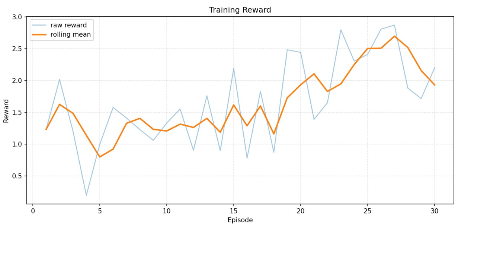
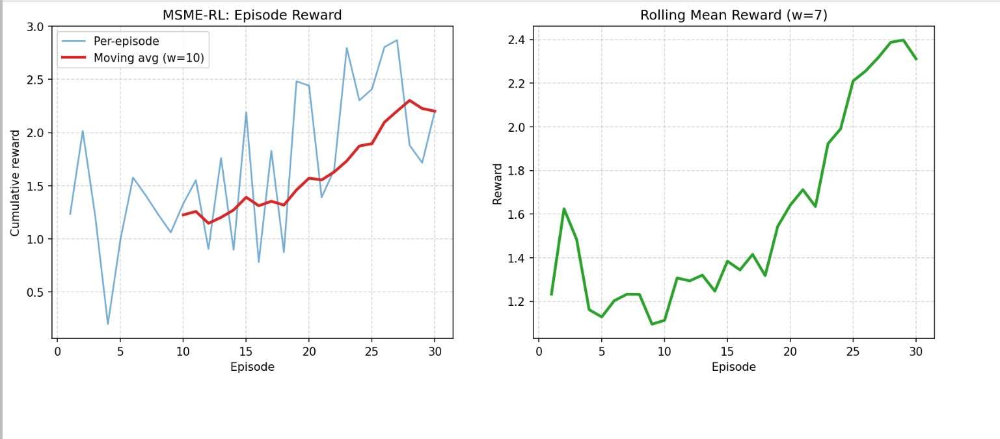

# 🧠 Linguistic Decoding RL

**A reinforcement learning environment for long-horizon hidden state inference — teaching an LLM agent to decode what entities actually mean, not just what they say.**

- **Hugging Face Space (training runner)**: [msme-training-runner](https://huggingface.co/spaces/devgodl/msmeEnv)
- **Colab notebook (training)**: [Open in Colab](https://colab.research.google.com/drive/1P7YalP0scTuiNrJGBPqwzdPRUkgN4f1w)
- **Blog link**: [Blog link](https://huggingface.co/spaces/devgodl/msmeEnv/blob/main/Blog.MD)

---

## The Core Problem

Language models are remarkably good at face value. Ask them what a message means and they will tell you what the words say. Ask them what the speaker *intends*, what they are *concealing*, or how their story has *shifted* over three conversations — and they fail. They anchor to the surface.

This is a fundamental gap. In the real world, the most important information is rarely stated directly:

- A borrower who says *"collections have been a bit slow but we're managing"* may be three months from default.
- A founder who says *"we're being strategic about burn"* may have six weeks of runway.
- The truth lives not in the words but in the **pattern across time** — the drift in tone, the gaps in documentation, the meetings that keep getting cancelled.

Linguistic decoding is the skill of inferring latent intent, hidden state, and real motive from what is said, how it is said, what is avoided, and how all of that changes across a temporal sequence. Teaching this to an AI system is a vast, open research problem. There is no clean dataset, no obvious loss function, and no single domain where it is fully solved.

---

## Scope — What We Built for This Hackathon

Linguistic decoding as a general problem is enormous. Narrowing it to something tractable within a hackathon timeline — while still producing real, meaningful results — required a deliberate choice of domain.

We chose **Indian MSMEs and startups** for a specific reason: both are high-stakes, information-asymmetric contexts where the cost of misreading intent is concrete and measurable. A lender or investor who takes language at face value in these settings does not just make a bad prediction — they make a bad financial decision with real consequences. The problem is also structurally interesting because the two populations have *opposite* communication biases: MSME borrowers in India systematically understate distress (cultural and social pressure to appear in control), while startup founders systematically overstate health (investor signalling incentives). An agent that can navigate both — learning to condition its interpretation on who is speaking before deciding what they mean — is doing something genuinely non-trivial.

This is the slice we modelled, trained on, and evaluated. The environment, the world generator, the message templates, the behavioral profiles, and the reward structure are all calibrated to this specific context. The results are real within this scope. Generalizing the framework to other domains — legal negotiation, medical disclosure, conflict resolution, political communication — is the natural next step, but that is future work.

---

## Why RL for This

Supervised learning teaches an agent to match outputs to labels. It cannot teach an agent to *reason under uncertainty across time* — to hold a hypothesis about a speaker's true state, update it as new signals arrive, and commit to an action whose consequences only materialize steps later.

This is a long-horizon planning problem. The right intervention at step 30 depends on what happened at steps 1 through 29. A premature escalation on a healthy entity is as damaging as inaction on a failing one. The agent must learn not just *what* to infer but *when* to act on it — and how much weight to give a single message versus an accumulated pattern.

GRPO-based training over multi-step episodes with delayed episode rewards makes this tractable — rewarding the agent for the quality of its full trajectory, not just individual decisions.

---

## What the Agent Learns

At each step, the agent:

1. Receives a **biased natural language message** from the entity
2. Observes **behavioral proxies** — response latency, document completion rate, meeting cancellations, escalation avoidance
3. Maintains a running **estimate of the hidden stress level** across the episode: `healthy → watch → substandard → doubtful → loss`
4. Selects a **policy action** from the intervention menu
5. Receives a **step reward** for action appropriateness and an **inference bonus** for correctly identifying the hidden state
6. Refines its policy across episodes via GRPO

The ground truth is never revealed during the episode. The agent must earn its estimate from accumulated evidence — exactly as a real analyst would.

---

## World Modelling

The environment generates a fully synthetic but internally consistent world for each episode. Every episode is a new entity — new hidden state, new financial profile, new behavioral disposition, new speaker bias. The world is not static; it evolves as the agent acts on it.

**Each entity is characterized by:**

- A **true stress level** drawn from a calibrated distribution per domain — invisible to the agent
- A **financial snapshot** — revenue growth, cash runway, debt service coverage, receivables overdue, burn rate — consistent with the stress level but not directly observable
- A **behavioral profile** — response latency, document completion, meeting cancellations, escalation avoidance — which drifts as the entity's condition changes across steps
- A **speaker bias** — the systematic tendency to understate (MSME) or overstate (startup) true condition, injected into every generated message

**The world evolves across steps.** A well-timed field visit slows deterioration. Inaction accelerates it. Messages and behavioral signals update each step to reflect the new underlying state. The agent is not reading a static transcript — it is navigating a living system that responds to its choices.

The world modelling is what prevents the agent from memorizing patterns. It must generalize a reasoning process that works across varied entities, bias levels, financial conditions, and deterioration trajectories.

---

## Environment Design

### Domains

| Domain | Speaker Bias | Sectors |
|--------|-------------|---------|
| **MSME** | Understatement | retail, manufacturing, agri-processing, logistics, hospitality |
| **Startup** | Overstatement | fintech, edtech, healthtech, SaaS, consumer |

Training across both domains is intentional — opposite bias directions force the agent to condition on who is speaking before interpreting what they say.

### Stress Levels (Hidden State)

```
healthy → watch → substandard → doubtful → loss
```

### Intervention Actions

| Action | Best Used When |
|--------|---------------|
| `do_nothing` | Entity is healthy, no signals of concern |
| `schedule_follow_up` | Early watch signals, non-urgent |
| `request_documents` | Financial ambiguity, verification needed |
| `conduct_field_visit` | Behavioral proxies deteriorating |
| `escalate_to_review` | Substandard or doubtful signals confirmed |
| `restructure_engagement` | Doubtful — intervention may still recover |
| `initiate_exit` | Loss-level — recovery unlikely |

Each level maps to calibrated financial snapshots, behavioral profiles, and message templates.

### Reward Structure

- **Step reward** — action appropriateness against true stress level (`-1.0 → +1.0`)
- **Inference bonus** — `+0.4` for correctly naming the hidden stress level; partial credit for adjacent estimates
- **Critical miss penalty** — `-0.5` for `do_nothing` or `schedule_follow_up` on `doubtful` or `loss` entities
- **Episode reward** — trajectory bonus for net stress reduction; terminal penalty for entities that end worse than they started

---

## Architecture

```
Domain Adapter Registry domains/__init__.py
        ▼
MSME + Startup Adapter  domains/msme_startup/adapter.py
        │
        ├──▶ world_generator.py      — hidden state + financial + behavioral synthesis
        ├──▶ message_generator.py    — biased NL message generation per step
        ├──▶ reward.py               — step + episode reward logic
        ├──▶ network.py              — peer entity contagion effects
        └──▶ memory.py              — cross-step state accumulation
```

---

## Training Results

We trained for 30 episodes with each episode capped at 90 steps, fine-tuning a **Qwen 1.5B** model with GRPO. Both numbers reflect resource constraints, not design ceilings — the environment is built for 300–500-step trajectories where long-horizon dynamics are fully expressed. Within these limits the goal was proof of concept: does the reward signal improve, does the policy stabilize, does the agent develop domain-differentiated strategies across MSME and startup profiles?

**The answer to all three is yes.**

You can reproduce and explore the run here:

- **Hugging Face Space (training runner)**: [msme-training-runner](https://huggingface.co/spaces/di35117/msme-training-runner)
- **Colab notebook (training)**: [Open in Colab](https://colab.research.google.com/drive/1P7YalP0scTuiNrJGBPqwzdPRUkgN4f1w)

---

### 1 — Episode reward across training



Reward climbs through the first 15 episodes as the agent unlearns high-penalty defaults — particularly `do_nothing` when behavioral signals are deteriorating. The curve flattens in the second half, indicating policy stabilisation rather than stagnation. Convergence within 30 episodes on a 1.5B model confirms the reward signal is well-shaped.

---

### 2 — Rolling mean reward



The moving average strips per-episode noise to make the trend legible. The plateau after episode 20 shows the agent has converged within the resource budget — it is not still learning rapidly when training stops. Useful for confirming that early gains are real and not artefacts of a noisy single-episode read.

---

### 3 — Baseline vs. trained distribution


The untrained baseline defaults to low-commitment actions regardless of signal — reward clusters near zero or below. After training, the distribution shifts toward `+0.3 → +0.8`. The negative tail shrinks but persists: heavily biased `loss`-level entities remain the hardest case, as expected. This comparison is the clearest single picture of what training achieves.

---

### 4 — Training metrics dashboard


A consolidated view of reward, KL divergence, entropy, and gradient norms across the full run. KL divergence stays bounded throughout, indicating stable updates without policy collapse. Entropy declines steadily — the agent becomes more decisive — without dropping to near-zero, which would signal premature overconfidence.

---

### 5 — Policy loss


Policy loss decreases consistently across episodes. The absence of spikes indicates that GRPO updates are absorbing new signal without destabilising previously learned behaviour — important given that the agent must hold two opposite bias models (MSME understatement, startup overstatement) simultaneously.

---

### 6 — GRPO policy loss


The GRPO-specific loss curve isolates the group-relative component of the objective. Its smooth descent confirms that the reward advantage estimates across sampled trajectories are consistent — the agent is learning from genuine within-group variation in outcome quality rather than fitting to noise.

---

## Training & Evaluation Workflow

```bash
# Baseline
py -3 scripts/run_baseline_eval.py --episodes 30 --output artifacts/baseline_rewards.json

# Train
py -3 train_grpo.py --episodes 30 --max_steps 90 --output_dir msme_rl_checkpoints

# Judge artifacts
py -3 scripts/generate_judge_artifacts.py \
    --training_json msme_rl_checkpoints/reward_curve.json \
    --baseline_json artifacts/baseline_rewards.json \
    --output_dir artifacts

# Deterministic eval
py -3 scripts/run_deterministic_eval.py --seed 123 --episodes 5 \
    --output artifacts/deterministic_eval.json

# Pre-submission check
py -3 scripts/pre_submit_check.py
```

---

## File Structure

```
msmeEnv/
├── openenv.yaml
├── pyproject.toml
├── __init__.py
├── train_grpo.py
├── world_generator.py
├── reward.py
├── network.py
├── memory.py
├── message_generator.py
├── server/
│   ├── app.py
│   └── msmeEnv_environment.py
├── domains/
│   ├── __init__.py
│   └── msme_startup/
│       └── adapter.py
└── scripts/
    ├── run_baseline_eval.py
    ├── eval.py
    ├── generate_judge_artifacts.py
    ├── pre_submit_check.py
    └── run_deterministic_eval.py
```

---

## What Comes Next

The 90-step cap was a resource limitation, not a ceiling. At 300–500 steps, the long-horizon dynamics become fully visible — entities that appear healthy at step 20 but deteriorate by step 80, requiring the agent to hold and update its hypothesis across a much longer evidence window. That is where the real test of linguistic decoding lives.

Beyond longer trajectories, the framework extends naturally to other high-stakes, information-asymmetric domains — legal negotiation, medical disclosure, HR conflict, political communication — anywhere that what is said and what is meant systematically diverge. The Indian MSME and startup context was the right scope for a hackathon. The architecture is built to go further.

---

## Tags

`openenv` · `reinforcement-learning` · `linguistic-decoding` · `long-horizon-planning` · `hidden-state-inference` · `world-modelling` · `grpo` · `credit-risk` · `llm-agent` · `latent-intent` · `india` · `msme` · `startup`
