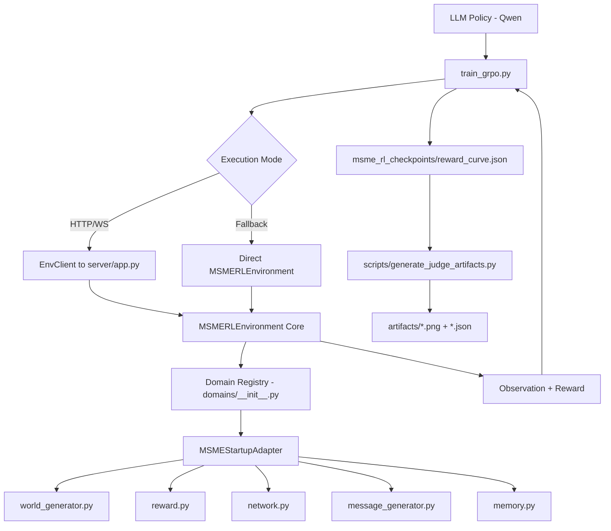
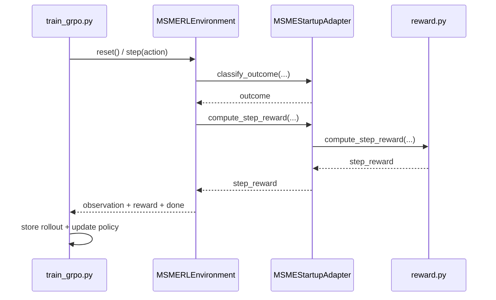

# MSME Linguistic Decoding RL - Architecture

## 1) System Purpose

This project implements an OpenEnv-compliant reinforcement learning environment where an LLM learns sequential decision-making for linguistic decoding under partial observability.

Current domain implementation is MSME + startup credit-risk management, designed to be extensible to additional domains via adapters.

---

## 2) High-Level Architecture

```text
LLM Policy (Qwen + SFT/GRPO)
        |
        v
Training Loop (`train_grpo.py`)
        |
        +--> Env Client mode (HTTP/WS) -> `server/app.py` -> `MSMERLEnvironment`
        |
        +--> Direct fallback mode      -> `server/msmeEnv_environment.py`
        |
        v
Domain Adapter Registry (`domains/__init__.py`)
        |
        v
MSME Startup Adapter (`domains/msme_startup/adapter.py`)
        |
        +--> World generation (`world_generator.py`)
        +--> Reward logic (`reward.py`)
        +--> Network propagation (`network.py`)
        +--> Message generation (`message_generator.py`)
        +--> Memory updates (`memory.py`)
```

### Renderable Architecture Diagram (Mermaid)



---

## 3) Core Runtime Components

- **Environment server**: `server/app.py`
  - Builds FastAPI app using OpenEnv server utilities.
  - Exposes standardized `reset`, `step`, `state` operations.

- **Environment core**: `server/msmeEnv_environment.py`
  - Owns episode lifecycle and step transitions.
  - Applies action validation, parameter validation, anti-abuse penalties.
  - Maintains cumulative rewards, alerts, month progression, and done conditions.
  - Uses adapter-driven domain logic to keep core generic.

- **Domain adapter layer**: `domains/base.py`, `domains/msme_startup/adapter.py`
  - Defines a stable contract for domain-specific behavior.
  - Current adapter delegates to production logic modules.

- **World model**: `world_generator.py`
  - Creates hidden + observable account states.
  - Implements curriculum-aware world initialization.

- **Reward/verifier logic**: `reward.py`
  - Step reward mapping for action outcomes.
  - Episode reward composition with anti-hacking penalties.
  - Anti-cheat metrics exported for evaluation/audit.

- **Network dynamics**: `network.py`
  - MSME cluster effects and startup ecosystem propagation.
  - Cross-contamination checks across account groups.

- **Memory subsystem**: `memory.py`
  - Episodic memory: prior trajectory cases.
  - Semantic memory: extracted high-level patterns.
  - Working memory: compact current-context summary.

---

## 4) Training Architecture

Training entrypoint: `train_grpo.py`

### 4.1 Policy Stack
- Base model: `Qwen/Qwen3-1.7B` (configurable).
- Optional Unsloth path if runtime supports it.
- HF Transformers fallback path for compatibility.

### 4.2 Two-Stage Learning
- **Stage A: SFT warm start**
  - Synthetic in-script demonstrations (structured prompt+completion pairs).
  - TRL SFTTrainer compatibility handling across versions.
- **Stage B: GRPO-like online updates**
  - Live rollouts against environment.
  - Prompt -> model completion -> parsed action -> environment step -> reward.
  - Advantage normalization and policy gradient updates.

### 4.3 Runtime Resilience
- Async/sync client compatibility handling.
- Automatic fallback from remote `EnvClient` to direct in-process environment.
- OOM mitigation (mini-batching, safer update flow, allocator config).

---

## 5) Anti-Hacking and Safety Controls

Implemented across env/reward:

- Action type validation against domain action registry.
- Parameter schema and range validation by action.
- Format/invalid action penalties.
- No-op farming / action spam / account-thrashing penalties.
- Per-account repeat/hammering penalties in step path.
- Budget-aware penalty proxy for excessively long reasoning payloads.
- Episode-level shortcut penalty and anti-cheat metrics export.

These controls reduce reward hacking and improve verifier robustness.

---

## 6) Evaluation and Artifact Pipeline

Scripts in `scripts/`:

- `run_baseline_eval.py`
  - Random policy baseline rewards (`baseline_rewards.json`).

- `run_deterministic_eval.py`
  - Fixed-seed reproducibility probe (`deterministic_eval.json`).
  - Tracks terminal-vs-partial reward source and done counts.

- `eval.py`
  - Random vs heuristic comparison (`eval_report.json`).

- `generate_judge_artifacts.py`
  - Converts training + baseline JSON into judge-ready visuals:
    - reward curve
    - loss curve
    - base-vs-trained distribution
    - per-episode comparison
    - summary + manifest JSON

- `pre_submit_check.py`
  - Validates required structure and artifact presence before submission.

---

## 7) Deployment Architecture

- OpenEnv manifest: `openenv.yaml`
- Runtime entrypoint: `server.app:app`
- Hosted on Hugging Face Space for judge pull/run.
- Local and remote execution parity supported by the same package layout.

---

## 8) Project Structure (Logical View)

```text
msme_env/
  server/      # OpenEnv/FastAPI serving layer and environment core
  domains/     # Adapter abstraction + concrete domain implementation
  scripts/     # Evaluation, artifact generation, and checks
  tests/       # Lightweight validation tests
  train_grpo.py
  reward.py
  world_generator.py
  network.py
  memory.py
  message_generator.py
  models.py
  client.py
  openenv.yaml
  pyproject.toml
```

---

## 9) End-to-End Data Flow

1. Environment reset generates hidden and observable world state.
2. Observation (plus memory context) is converted to policy prompt.
3. LLM emits structured action JSON.
4. Environment validates action, applies domain dynamics, computes reward.
5. Rollout tuples are stored for GRPO updates.
6. Model weights are updated to increase higher-reward behavior.
7. Metrics and artifacts are generated for baseline-vs-trained evidence.

This closes the full RL loop required by OpenEnv judging criteria.

---

## 10) Sequence Diagram (One Training Step)


